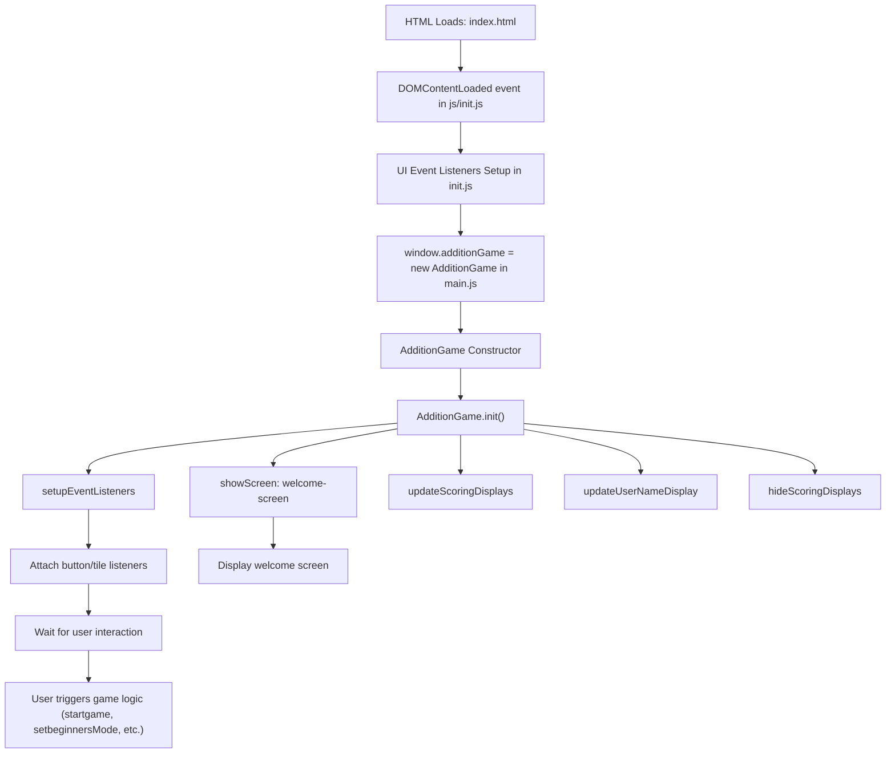

# Addition Game Startup Sequence

This document describes the startup sequence of the Addition Game web app, focusing on the order of function calls and their locations in the codebase.

---

## 1. HTML Loads

- The browser loads `index.html`, which includes your JavaScript files (`js/init.js`, `js/main.js`, etc.).

## 2. js/init.js: DOMContentLoaded Event

- The main entry point is in `js/init.js`:

  ```js
  window.addEventListener("DOMContentLoaded", () => { ... });
  ```

- This event fires when the HTML is fully parsed.

## 3. init.js: UI Event Listeners Setup

- Inside the DOMContentLoaded handler, event listeners are attached to UI elements (buttons, tiles, etc.).
- Example: Mode switch button, number tiles, back buttons.

## 4. Game Initialization

- Still inside `init.js`, the following code runs:

  ```js
  if (window.AdditionGame) {
    window.additionGame = new window.AdditionGame();
    // ...other setup...
  }
  ```

- This creates a new instance of the `AdditionGame` class (defined in `js/main.js`).

## 5. js/main.js: AdditionGame Constructor

- The constructor for `AdditionGame` runs:
  - Initializes game state, settings, stats, matrices, etc.
  - Calls `this.init()`.

## 6. js/main.js: AdditionGame.init()

- The `init()` method:
  - Shows the welcome screen (`this.showScreen("welcome-screen")`)
  - Calls `this.setupEventListeners()` to attach additional event listeners.
  - Updates scoring displays, user name, and hides scoring displays after a short delay.

## 7. User Interaction

- After initialization, the app waits for user interaction (clicks, touches, etc.).
- Event listeners trigger methods in the `AdditionGame` class (e.g., `startgame`, `setbeginnersMode`, etc.).

---

### Function Locations

- **UI event listeners & DOMContentLoaded handler:** `js/init.js`
- **AdditionGame class, constructor, and methods:** `js/main.js`
- **Game logic, state management, and UI updates:** Methods inside `AdditionGame` (e.g., `init`, `setupEventListeners`, `showScreen`, `setbeginnersMode`, etc.)

---

**Summary:**

- Startup begins in `js/init.js` (DOMContentLoaded handler).
- Instantiates `AdditionGame` from `js/main.js`.
- Runs constructor and `init()` method.
- Sets up UI and waits for user input, which triggers further game logic.

---

Let me know if you want a step-by-step call graph or more details on any specific function!

---

## Step-by-Step Call Graph



---

This call graph visualizes the startup sequence, showing how control flows from HTML loading to game initialization and user interaction. Each node represents a function or major step, with arrows indicating the order of execution.
